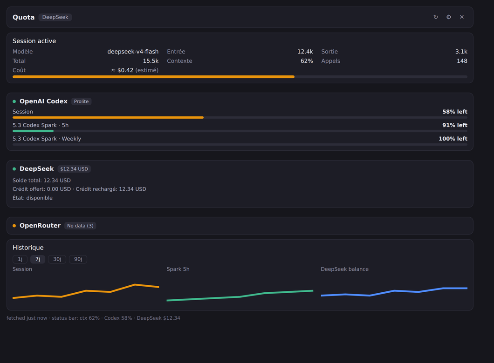

# quota-hermes

> Live quota & session usage for [Hermes](https://hermes-agent.nousresearch.com/) —
> compact status-bar chips, a bottom docked pane, a full `/quota` page, and a
> CLI, for any user with a standard Hermes install.

A provider-agnostic quota / rate-limit indicator for Hermes Desktop: it shows
per-provider quota windows, prepaid balances (DeepSeek), and the focused
session's model / tokens / context / calls / qualified cost. The Desktop widget
never receives credentials and never calls provider APIs directly — the Python
backend refreshes a local cache and the widget reads it through the local Hermes
gateway.



## Features

- **Status bar (bottom-right):** context occupancy, percentage-based quota
  chips, and a currency-aware balance chip for prepaid providers such as
  DeepSeek. Hover for the full provider/window breakdown. Toggle between
  *worst only* and *all providers* in Settings. Clicking any chip toggles the
  bottom Quota pane: first click opens it, a second click on the same chip
  closes it, and clicking another chip retargets it in place. The pane header
  shows which chip opened it and offers its own close button.
- **Session active card:** follows the currently focused Hermes session. It
  shows the real session model, cumulative input/output/total tokens, current
  context occupancy (kept distinct from cumulative tokens), and API-call count.
  Cost is read from that exact stored session and rendered only as **real**,
  **estimated API equivalent**, **subscription included**, or **unavailable** —
  never as an unqualified or invented `$0`.
- **Quota surfaces:** one card per provider with the official brand icon, tonal
  progress bars, plan badge, and optional details. The same view is available as
  a 340 px bottom pane and as the `/quota` page. Providers without data collapse
  into a quiet "No data" section.
- **History:** 1/7/30/90-day provider window/balance sparklines. Snapshots are
  local JSONL, deduplicated to one per minute, retained for 90 days, and
  downsampled to at most 60 points per series.
- **Ordering:** Session active → OpenAI Codex → DeepSeek → other providers.
- **Cherry-pick providers:** in Quota Settings, toggle any provider on or off.
  Your choice is local and persists.
- **CLI:** `hermes quota`, `hermes quota refresh`, `hermes quota status [--json]`,
  `hermes quota history --json --days {1,7,30,90}`, and
  `hermes quota provider <name>`.

## Supported providers

`anthropic`, `openai-codex`, `deepseek`, `nous`, `openrouter`, `gemini`, `kimi`,
`opencode-go`, `copilot`, plus `grok` (opt-in). Each fetcher is fail-open: a
broken or unconfigured provider shows `unavailable (<reason>)` and never blocks
the others.

DeepSeek reads the official `GET /user/balance` endpoint and reports every
returned balance currency (USD/CNY), plus available/depleted status. The compact
status-bar chip prefers USD when both currencies are returned. It emits **no
percentage bar** — a prepaid balance has no rolling-window denominator, and the
plugin never fakes a percent.

The OpenAI Codex fetcher goes beyond the core: it parses
`additional_rate_limits` to surface **per-model Spark limits**
(`5.3 Codex Spark · 5h`, `5.3 Codex Spark · Weekly`) that would otherwise stay
hidden.

## Prerequisites

- A working [Hermes](https://hermes-agent.nousresearch.com/) install with
  `hermes` on `PATH` (the installer shells out to `hermes config`).
- Python 3.9+ (used by the installer and the backend).
- Node.js is **not** required at runtime; it is only needed to run the widget
  syntax checks / tests in development.

## Supported / tested Hermes versions

- **Tested with:** Hermes `v0.20.5` (gateway + desktop plugin SDK, `cli.exec`
  bridge, `host.state.focusedUsage`).
- **Expected to work with:** any Hermes build exposing the desktop plugin SDK
  (`@hermes/plugin-sdk`, `host.request('cli.exec', …)`, `host.state.*`) and the
  `hermes_cli.plugins` registration API.
- The optional `footer` / `usage_extra` lifecycle hooks are registered **only
  when** the running build exposes them in `VALID_HOOKS`; on builds that don't,
  they are silently skipped and the widget / `/quota` / CLI keep working.

## Installation

`quota-hermes` has two parts:

- the **Python backend** (`plugins/quota/`) — used by the Hermes gateway/CLI
  (`hermes quota …`);
- the **Desktop widget** (`desktop-plugins/quota/plugin.js`) — loaded **locally**
  by the Hermes Desktop app.

Install whichever part runs on this machine.

### Single machine — Hermes and Desktop on the same host

```bash
git clone https://github.com/tetrax/quota-hermes.git
cd quota-hermes
./install.sh
```

Installs the backend **and** the widget, and enables the plugin for every
Hermes profile without touching your other plugins. It is **idempotent** — re-run
it anytime to update. `./uninstall.sh` removes everything it installed on this
machine.

### Remote gateway / VPS — Hermes on the server, Desktop on your laptop

On the server (Hermes gateway):

```bash
./install.sh --backend-only
```

On the machine that runs Hermes Desktop:

```bash
./install.sh --desktop-only
```

**Both installations are required when they run on different machines:** the
Python backend is used on the Hermes/gateway side, while `desktop/plugin.js`
is loaded locally by Hermes Desktop. With the widget only, the Desktop pane
shows *backend unavailable* until the backend is installed on the gateway; with
the backend only, the CLI works but no widget exists on the Desktop machine.

> `./install.sh` (no flag) prints this split clearly at the end of the install,
> so the remote-gateway case is visible in the terminal even without reading
> this README.

Verify (on the gateway machine):

```bash
hermes plugins doctor quota && hermes quota refresh && hermes quota status
```

> **Restart Hermes Desktop completely** after install/update. Reloading plugins
> refreshes the widget only — the Python backend mounts at process start. Run
> `hermes quota refresh` once per profile (the quota cache is per-profile).

### Multiple Hermes profiles

Hermes resolves plugins **per profile**: both the Python backend scanner
(`<profile>/plugins/`) and the Desktop widget loader
(`<profile>/desktop-plugins/`) read from the *active profile's* Hermes home —
only the `default` profile uses the global `~/.hermes/` roots. `./install.sh`
handles this by symlinking `plugins/quota` and `desktop-plugins/quota` into
every existing profile, so all profiles share one real copy; re-running the
installer after a `git pull` updates every profile at once. `./uninstall.sh`
removes those links (symlinks only; real directories you created yourself are
left untouched).

## Configuration

Providers read credentials through Hermes' standard mechanisms (OAuth/CLI
logins, credential pool, or environment variables). No credential belongs in
this repository.

### DeepSeek

DeepSeek is **optional**. With no key configured, the plugin keeps working and
DeepSeek simply shows `unavailable (no-credentials)`.

Configure the key the standard Hermes way:

```bash
# Preferred: Hermes credential pool
hermes auth add --type api-key --api-key sk-... deepseek

# Alternative: environment variable in your Hermes .env
# $HERMES_HOME/.env  →  DEEPSEEK_API_KEY=sk-...
```

Never put a key in source code. The key is resolved in-process at refresh time
and is never written to the cache, the history file, or the Desktop JavaScript.

### Grok (opt-in)

Grok is the only provider read from your browser (Firefox `grok.com` cookies) —
there is no clean API path right now. It is **disabled by default**. Turn it on:

```bash
hermes config set plugins.entries.quota.settings.grokEnabled true
hermes quota refresh
```

When off, Grok simply reports `opt-in-disabled`. No cookies are read, no files
written.

## Usage

- **Desktop:** the status-bar chips appear bottom-right; the Quota entry is in
  the sidebar; the pane opens bottom-docked (340 px). The same view is reachable
  at the `/quota` page.
- **In-session command:** `/quota` (alias for a status view; `/quota refresh`
  forces a re-fetch).
- **CLI:** see below.

## Commands

```bash
hermes quota                                   # provider status summary
hermes quota refresh                           # force a re-fetch now
hermes quota status --json                     # machine-readable status
hermes quota history --json --days 30          # provider history series
hermes quota provider openai-codex             # single provider detail
```

## Updating

```bash
cd quota-hermes
git pull
./install.sh
```

If you installed with a mode flag, re-run the same command on the same machine
(`./install.sh --backend-only` or `./install.sh --desktop-only`). Then restart
Hermes Desktop completely and run `hermes quota refresh`.

## Uninstalling

```bash
cd quota-hermes
./uninstall.sh
```

This restores `plugins.enabled` / `plugins.disabled` to their previous state,
removes the backend and widget directories, and deletes only the per-profile
symlinks it created.

## Troubleshooting

| Symptom | Cause / fix |
|---|---|
| Widget shows "backend unavailable" | The Python backend isn't mounted yet, or you're in a named profile whose copy is missing. Restart Hermes Desktop completely; run `hermes plugins doctor quota`. |
| Chips / pane don't appear at all | Reload desktop plugins (⌘K → *Reload desktop plugins*), or check the status bar is enabled (⌘K → *Toggle status bar*). |
| DeepSeek shows `no-credentials` | No key configured. See [DeepSeek](#deepseek). |
| A provider shows `unavailable (…)` | That provider is unconfigured or its fetch failed; the rest are unaffected (fail-open). |
| History is empty | History starts on first refresh and needs **at least two** refreshes to draw a sparkline. |
| Cost row says "unavailable" | Hermes didn't provide a qualified cost for this session (see [Limitations](#known-limitations)). |

## Security & credential storage

- **No secrets in Git, cache, or Desktop JS.** The cache
  (`$HERMES_HOME/quota_cache.json`) and history (`$HERMES_HOME/quota_history.jsonl`)
  store only window percentages / balance amounts and metadata.
- **Credentials stay in Hermes.** Provider keys/OAuth tokens are read through
  Hermes' resolver and never printed, logged, or sent to the widget.
- **No background network beyond provider fetches.** The upstream hourly GitHub
  update request is **removed**; the Desktop JavaScript calls only the local
  Hermes gateway. No remote `install.sh` is ever fetched and executed.
- **`cli.exec` argv is fixed and validated.** The widget invokes only
  `quota status|refresh|history` with constant argv; no shell interpolation.
- **Fail-open, no fake zeros.** A missing value is `unavailable`, never `0%` or
  `$0.00`.

## Known limitations

- **`footer` / `usage_extra` hooks** are not activated on Hermes builds that
  don't expose them in `VALID_HOOKS` (e.g. v0.20.5). Active surfaces are the
  Desktop widget, `/quota`, and the CLI.
- **Session cost** is read from Hermes' internal `state.db` (fail-open). If a
  future Hermes build changes that schema, the cost row degrades to
  "unavailable" rather than misreporting.
- **Session model / context** come from the internal
  `session.context_breakdown` RPC (fail-open); a build change hides those rows
  without breaking quotas.
- **History lock is process-local.** Two concurrent refreshes from separate
  processes could rarely drop one snapshot; writes are atomic (`os.replace`), so
  the file never corrupts.
- **History is not retroactive.** It starts at installation and needs two
  snapshots before a sparkline appears.
- **DeepSeek** is a prepaid balance: it shows an amount, not a percentage.

## Attribution & upstream

`quota-hermes` is a fork of
[rarf/hermes-quota-plugin](https://github.com/rarf/hermes-quota-plugin)
(MIT), based on upstream SHA **`1942e99`**.

Major changes on top of that base:

- **DeepSeek** balance provider (official `GET /user/balance`, USD/CNY).
- **Focused Session-active card** with qualified cost (real / estimated API
  equivalent / subscription included / unavailable), bound to the exact focused
  session.
- **Provider history** (1/7/30/90 days, local JSONL, 90-day retention).
- **Status-bar context chip** with orange (≥70%) / red (≥85%) alerts, and a
  generic currency chip for prepaid providers.
- **Docked bottom pane** with open/close/retarget toggle on chip clicks.
- **GitHub auto-update check removed.**
- Standalone unit tests, Node widget tests, and CI.

### Syncing with upstream later

```bash
git remote add upstream https://github.com/rarf/hermes-quota-plugin.git
git fetch upstream
git log --oneline main..upstream/master    # review incoming changes
git merge upstream/master                  # deliberate, then re-test + ./install.sh
```

## License

[MIT](LICENSE) — Copyright (c) 2026 rarf; Copyright (c) 2026 quota-hermes
contributors. Provider icons are from [@lobehub/icons](https://lobehub.com/icons)
(MIT).
